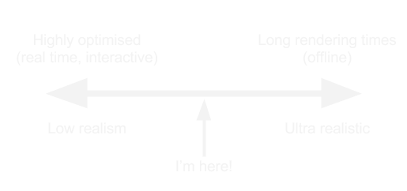
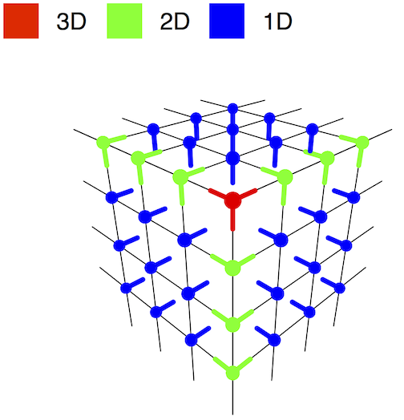
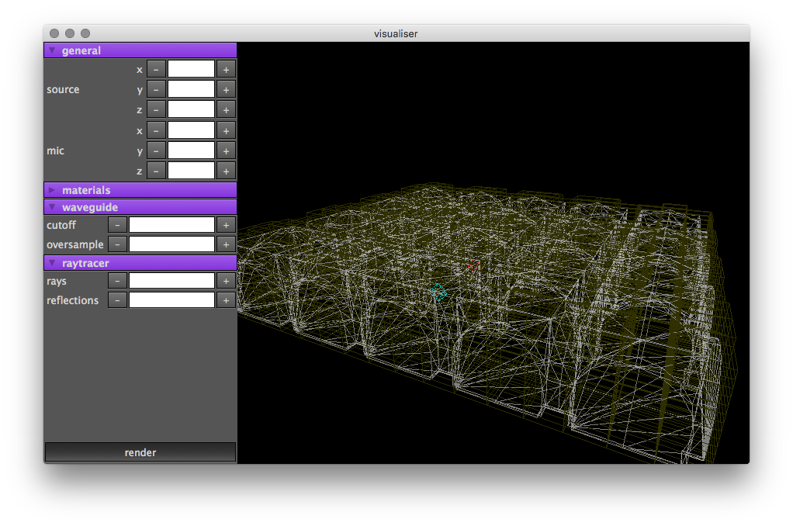
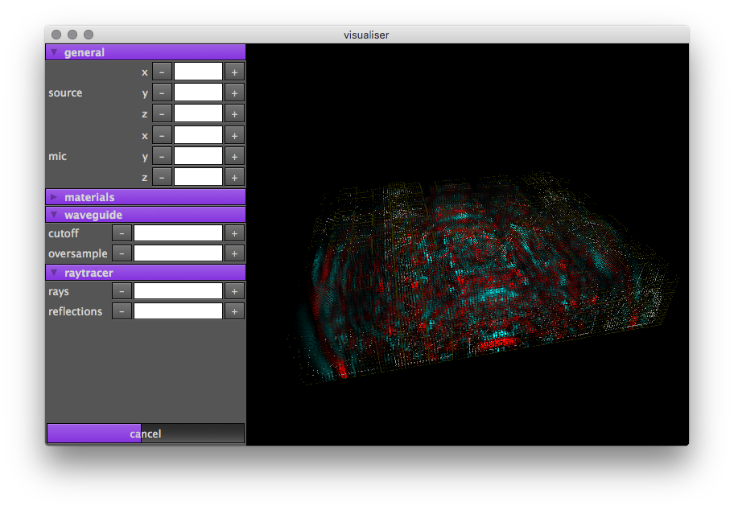

A Graphical Tool for Hybrid Modelling Auralisation
==================================================

* a program for simulating acoustics of virtual environments
    * offline, not real-time
    * produce impulses for use with convolution reverbs
        * space designer, altiverb etc.

* friendly and fast

Why?
----
* better sound quality than plug-in reverbs
* don't need to record custom impulse responses
    * costly, time-consuming

*not* aiming to develop new modelling techniques

bringing together existing techniques which haven't previously been available
in open source software

Model components
----------------

* Ray tracer
    * high frequencies (above ~600 Hz)
        * waves only behave like rays at high frequencies
    * fast but doesn't model wave effects
        * cancellation, diffraction

* Waveguide
    * low frequencies
    * slower but models wave effects

Goals
-----

* Ray tracer
    * 'finished' during undergrad
    * diffuse reflections still need work

* Waveguide
    * Microphones
    * Boundaries/surfaces

* Automatically combining the two models

* User interface

Progress
--------

* At the last progression talk
    * tetrahedral waveguide mesh library
    * microphone + HRTF modelling
    * visualiser app

* Since then
    * boundaries
    * boundaries
    * more boundaries

(so no audio examples, sorry)

Boundary modelling
------------------

*No perfect solutions*

Three Main Approaches
---------------------

* Diffuse surface modelling
* KW pipe method
* Locally reacting surfaces

Diffuse surface modelling
-------------------------

* Simon Benedict Shelley
* not frequency-dependent!

KW pipe method
--------------
* Damian Murphy
* boundaries are 1D
    * nodes on boundaries don't know about adjacent nodes
    * 'ignores' the mesh update equations
    * unphysical
* but frequency dependent

Locally reacting surfaces
-------------------------
* Konrad Kowalczyk
* boundary nodes are connected to adjacent nodes
    * integrates the mesh update equations
    * better physical model
* can only cope with mesh-aligned surfaces
* also frequency dependent

Locally Reacting Surfaces
-------------------------

*More complicated than I expected*

* Wall impedance governed by an arbitrary IIR filter
    * Very flexible

* *BUT* boundaries must be mesh-aligned
    * can't align flat surfaces to a tetrahedral mesh

* Had to reimplement the waveguide as a rectilinear mesh
    * Luckily microphone modelling still works in this mesh

* With this done, the boundary modelling itself is very straightforward
    * Just run a different update equation if a node is a boundary node

* Complexity arises in setting up the simulation
    * Each boundary node must keep track of its own IIR filter state
        * How to structure data which goes to the GPU?
    * Need a method for classifying boundary nodes, quickly looking up
      surface characteristics for each node

* The user doesn't know what the app is doing
    * If the simulation is blazing fast but the set-up is slow, the user is still waiting...
    * My implementation doesn't handle this very well!

*eventually...*

Boundary implementation works!

* But, it highlighted issues with other parts of the model

Input signal
============

* The ideal case
    * Place a single impulse at the input node
        * Don't update the input node at each time step
    * Post-process with an anti-aliasing filter
    * Simple *and* fast
        * basically never happens, so rejoice when it does

However
-------

* Placing a single impulse (dirac delta) at a node creates a constant velocity
  offset at nearby nodes (I think)

* Sum pressure in the mesh increases over time

* Nasty increasing DC offset in impulse responses

* Unusable

Solutions
----------

* DC blocking filter at output
    * not great in terms of numerical precision
    * introduces filtering artefacts like pre-ring

* Apply a longer, filtered input signal
    * hopefully no solution growth
    * but we have to update the input node each time step
    * makes integration with ray tracer difficult

* Samuel Siltanen presents a method for matching the levels of waveguide and ray tracer simulations
    * calibrated based on a delta input, not a longer, filtered one

In practice
-----------

Haven't found a great solution yet

* Cause of solution growth isn't *just* due to the input signal
    * Research by Damian Murphy shows solution growth even when taking
      corrective measures, and at double-precision

* Hyok Jeong presents an improved input method and signal
    * reduced low-frequency content in output
    * *but* unclear how parameters of signal are calculated
        * difficult to integrate into existing model

The Future
==========

Nearly working:
* stable input signals
* combined waveguide and ray tracer output

Still to do:
* User interface
* (check raytracer diffuse reflections)
* Write-up / website

`github.com/reuk/wayverb`
